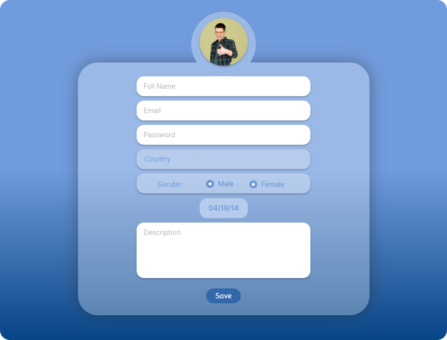

# 📝 Forms

This project is a collection of form templates built using **HTML** and **CSS**.  
It was created as part of a training program at **OFPPT** under the supervision of **M.Mounia**.

## 📸 Screenshots

Some example forms:

  



## 📁 Project Structure

- `index.html` – Main page  
- `pages/` – Additional form pages  
- `styles/` – CSS files  
- `images/` – Screenshots and images  

## 🚀 How to Run
Visit :
https://azddine-01.github.io/Forms

### Or

1. Clone the repository:
   ```bash
   git clone https://github.com/azddine-01/Forms.git
   cd Forms
   ```
2. Open index.html in your browser.

